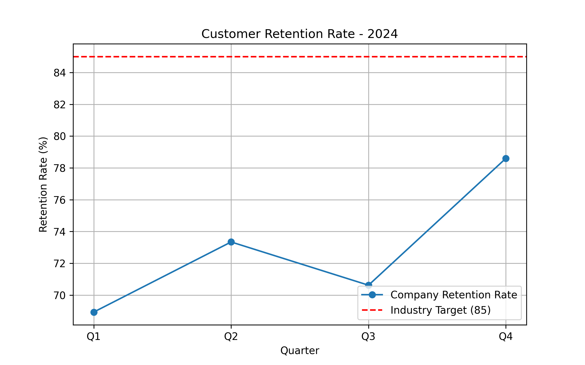

# Customer Retention Analysis - 2024

**Email:** 24f2001915@ds.study.iitm.ac.in

## 📊 Dataset
Quarterly retention data for 2024:

| Quarter | Retention Rate |
|---------|----------------|
| Q1      | 68.93%         |
| Q2      | 73.34%         |
| Q3      | 70.62%         |
| Q4      | 78.60%         |
| **Average** | **72.87%** |

**Industry Target:** 85%

---

## 🔑 Key Findings
1. The company’s **average retention rate is 72.87%**, well below the **industry benchmark of 85%**.
2. Retention improved in Q4 (78.6%), but still falls short of the target.
3. The data shows **fluctuating retention performance** across quarters, suggesting inconsistent customer loyalty strategies.

---

## 📉 Business Implications
- Lower retention increases customer acquisition costs and reduces long-term profitability.
- Falling behind industry benchmarks risks **losing market share** to competitors with stronger loyalty programs.
- Inconsistent quarterly performance indicates potential **gaps in customer engagement initiatives**.

---

## 🎯 Recommendations
To close the gap and reach the **85% target**, the company should:

1. **Implement targeted retention campaigns**:
   - Personalized loyalty programs
   - Subscription perks & discounts
   - Enhanced customer support
2. **Conduct churn analysis** to identify at-risk customers earlier.
3. **Strengthen post-purchase engagement** (email follow-ups, recommendations).
4. **Leverage predictive analytics** to optimize retention spend.

---

## 📈 Visualization

The plot shows quarterly retention rates compared to the industry target.

---

## ✅ Conclusion
The company must take **proactive action on retention strategies**. Implementing **targeted retention campaigns** is essential to close the gap from **72.87% → 85%**, aligning with industry standards and driving long-term growth.

## Retention Analysis Branch
This branch contains updates for retention analysis.
